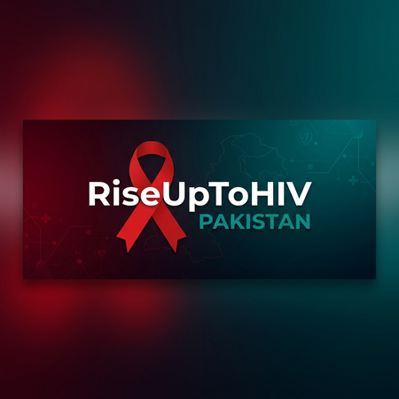

## This project is build by : Ambreen Abdul Raheem
### The Data Analyst and Web Developer
**For more follow me on:**

**[GitHub](https://github.com/ambreenraheem)**

**[LinkedIn](https://www.linkedin.com/in/ambreen-abdul-raheem/)**

**[YouTube](https://www.youtube.com/@AmbreenAbdulRaheem-y8m)**

## PAKISTAN-HIVSOLUTIONS

#### Education, Care & Hope for Every Pakistani

A comprehensive platform connecting people with HIV education, care services, and advocacy across all provinces of Pakistan - free, confidential, and accessible.

**This Project is only for information and awareness.**

#### Knowledge That Protects & Empowers
Accurate, accessible information in plain language , covering prevention, treatment, living well, and Pakistan-specific health guidance.

### IMPORTANT NOTE:
#### This platform provides public health information only and does not constitute medical advice. Always consult a qualified healthcare professional.

### Data sourced from
#### (NACP · UNAIDS · DGHS)

© 2026 Pakistan-HIVSolutions. All information is public health data for educational purposes.